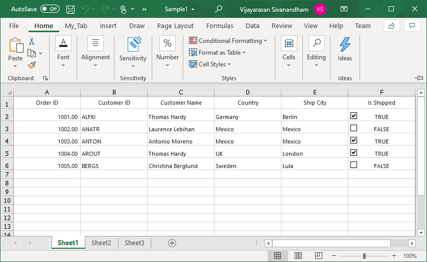

# How to Export the excel file with checkbox in WinForms DataGrid (SfDataGid)?

## About the sample
This example illustrates how to Export the excel file with checkbox in [WinForms DataGrid](https://www.syncfusion.com/winforms-ui-controls/datagrid) (SfDataGrid)? 

[WinForms DataGrid](https://www.syncfusion.com/winforms-ui-controls/datagrid) (SfDataGrid) does not provide the direct support to export the excel file with a checkbox. You can export the excel file with a checkbox by customization the [CellExporting](https://help.syncfusion.com/cr/windowsforms/Syncfusion.WinForms.DataGridConverter.ExcelExportingOptions.html#Syncfusion_WinForms_DataGridConverter_ExcelExportingOptions_CellExporting) event of the [ExcelExportingOptions](https://help.syncfusion.com/cr/windowsforms/Syncfusion.WinForms.DataGridConverter.ExcelExportingOptions.html) in [WinForms DataGrid](https://www.syncfusion.com/winforms-ui-controls/datagrid) (SfDataGrid).

```C#

GridExcelExportingOptions.CellExporting += Options_CellExporting1;

private void Options_CellExporting1(object sender, Syncfusion.WinForms.DataGridConverter.Events.DataGridCellExcelExportingEventArgs e)
{
    // Based on the column mapping name and the cell type, we can change the cell values while exporting to excel.
    if (e.CellType == ExportCellType.RecordCell && e.ColumnName == "IsShipped")
    {
        //add the checkbox into excel shhet
        var checkbox = e.Range.Worksheet.CheckBoxes.AddCheckBox(e.Range.Row, e.Range.Column, 20, 20);

        //set the checked or unchecked state based on cell value
        if (e.CellValue.ToString().ToLower() == "true")
            checkbox.CheckState = ExcelCheckState.Checked;
        else if (e.CellValue.ToString().ToLower() == "false")
            checkbox.CheckState = ExcelCheckState.Unchecked;

        //Created check box with cell link
        checkbox.LinkedCell = e.Range.Worksheet[e.Range.AddressLocal];

        e.Handled = true;
    }
}

```


The following screenshot shows the exported excel file with a checkbox,



Take a moment to peruse the [WinForms DataGrid – Export to Excel](https://help.syncfusion.com/windowsforms/datagrid/exporttoexcel) documentation, where you can find about export to excel with code examples.

## Requirements to run the demo
Visual Studio 2015 and above versions
